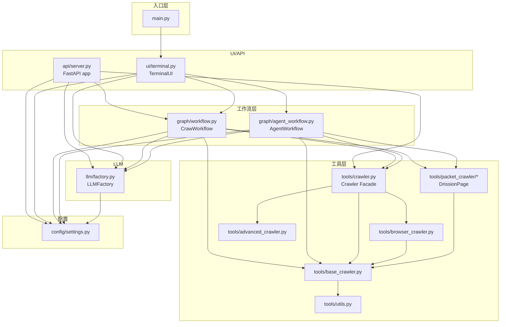

# CrawAgent · Code Wiki

> 项目根目录：`crawagent/`
> 入口文件：[main.py](file:///c:/Users/MOM/Desktop/学习项目/CrawAgent/main.py)
> 配套图谱：[CODEGRAPH.md](file:///c:/Users/MOM/Desktop/学习项目/CrawAgent/CODEGRAPH.md)（含 Mermaid 依赖图）
> 依赖清单：[requirements.txt](file:///c:/Users/MOM/Desktop/学习项目/CrawAgent/requirements.txt)
> 模型配置：[models.json](file:///c:/Users/MOM/Desktop/学习项目/CrawAgent/models.json)

---

## 1. 项目总览

CrawAgent 是一个**配置驱动的多模型智能爬虫 Agent**，目标是让用户用自然语言/命令驱动网页爬取、解析、整理、下载与摘要。

### 1.1 核心能力

- **多策略爬取**：基础 HTTP、Playwright 浏览器、Scrapling（TLS 指纹 + 隐身）、DrissionPage 网络抓包 四套爬虫可热切换
- **多 LLM 接入**：OpenAI 兼容 API（DeepSeek、OpenAI、LM Studio、Ollama 等）+ Anthropic Claude，通过 [models.json](file:///c:/Users/MOM/Desktop/学习项目/CrawAgent/models.json) 动态切换
- **两种工作流**：
  - `CrawWorkflow`：关键词匹配、顺序节点
  - `AgentWorkflow`（默认）：基于 LangGraph 的 Think → Act → Observe → Reflect 循环
- **专门场景爬虫**：视频网站元数据、抖音搜索/详情、壁纸网站（haowallpaper）、抖音/B 站/优酷/腾讯视频抓包
- **双前端**：
  - 终端 UI（[TerminalUI](file:///c:/Users/MOM/Desktop/学习项目/CrawAgent/crawagent/ui/terminal.py#L291-L819)）
  - FastAPI HTTP 服务（[server.py](file:///c:/Users/MOM/Desktop/学习项目/CrawAgent/crawagent/api/server.py)）

### 1.2 适用场景

| 场景 | 路径 |
|------|------|
| 普通网页抓取与摘要 | `basic` → `agent` |
| SPA / JS 渲染 / 反爬站点 | `browser` 模式自动触发 |
| 视频元数据（优酷/B 站/爱奇艺等） | `smart_scrape_videos` |
| 抖音搜索/单视频下载 | `scrape_douyin_*` |
| 优酷/B 站/抖音抓包 | `packet_crawler`（DrissionPage） |
| 壁纸批量下载（haowallpaper） | `smart_scrape_wallpapers` |
| Cloudflare 等强反爬 | `advanced_crawler`（Scrapling） |

---

## 2. 架构全景

### 2.1 分层架构图

```
┌─────────────────────────────────────────────────────────┐
│  main.py            入口 / CLI                           │
├─────────────────────────────────────────────────────────┤
│  ui/terminal.py     TerminalUI (Rich + prompt_toolkit)   │  展示层
│  api/server.py      FastAPI REST                          │
├─────────────────────────────────────────────────────────┤
│  graph/agent_workflow.py   AgentWorkflow (LangGraph)      │  编排层
│  graph/workflow.py         CrawWorkflow  (顺序)           │
├──────────────────────┬──────────────────────────────────┤
│  llm/factory.py      │  tools/crawler.py  (Facade)       │  能力层
│  (LLMFactory)        │  tools/base_crawler.py            │
│                      │  tools/browser_crawler.py         │
│                      │  tools/advanced_crawler.py        │
│                      │  tools/packet_crawler/*           │
│                      │  tools/utils.py                   │
├──────────────────────┴──────────────────────────────────┤
│  config/settings.py   Settings + ModelConfig              │  配置层
│  models.json                                          │
└─────────────────────────────────────────────────────────┘
```

### 2.2 模块依赖图



---

## 3. 目录结构与文件职责

```
CrawAgent/
├── main.py                       # CLI 入口（仅启动 TerminalUI）
├── models.json                   # 模型注册表（当前模型 + 模型列表）
├── requirements.txt              # 第三方依赖
├── .env.example                  # 环境变量模板（可选）
├── CODEGRAPH.md                  # 自动生成的 Mermaid 依赖图
│
├── crawagent/                    # 核心包
│   ├── __init__.py
│   │
│   ├── config/                   # 配置层
│   │   ├── __init__.py
│   │   └── settings.py           # ModelConfig / Settings / load_settings
│   │
│   ├── llm/                      # LLM 工厂层
│   │   ├── __init__.py
│   │   └── factory.py            # LLMFactory + to_chat_messages
│   │
│   ├── tools/                    # 工具层（爬取能力）
│   │   ├── __init__.py           # 统一导出（带容错）
│   │   ├── utils.py              # UserAgentPool / 数据导出
│   │   ├── base_crawler.py       # BaseCrawler / URL 提取 / 视频/壁纸元数据
│   │   ├── browser_crawler.py    # BrowserCrawler (Playwright)
│   │   ├── crawler.py            # Crawler Facade（自动选策略）
│   │   ├── advanced_crawler.py   # AdvancedCrawler (Scrapling)
│   │   └── packet_crawler/       # DrissionPage 网络抓包
│   │       ├── __init__.py
│   │       ├── core.py           # PacketCrawler
│   │       ├── types.py          # VideoItem / EpisodeInfo / ShowInfo
│   │       ├── extractors.py     # 抖音/B 站/通用提取
│   │       ├── youku.py          # 优酷 m3u8 解析
│   │       ├── ffmpeg.py         # ffmpeg 工具封装
│   │       ├── rss_api.py        # Land8028 等聚合站 API
│   │       └── login_and_save_cookie.py
│   │
│   ├── graph/                    # 编排层
│   │   ├── __init__.py
│   │   ├── workflow.py           # CrawWorkflow（旧版 5 节点顺序流）
│   │   └── agent_workflow.py     # AgentWorkflow（LangGraph 4 节点循环）
│   │
│   ├── ui/                       # 展示层
│   │   ├── __init__.py
│   │   └── terminal.py           # TerminalUI + ConsolePrinter
│   │
│   └── api/                      # HTTP 展示层
│       ├── __init__.py
│       └── server.py             # FastAPI app
│
├── docs/                         # 设计文档
│   └── superpowers/specs/
│       └── 2026-06-20-phase2-browser-automation-design.md
│
├── output/                       # 运行时生成（图片/视频/导出）
│   ├── img/
│   └── video/
│
└── .venv/                        # 虚拟环境（已安装依赖）
```

---

## 4. 模块详解

### 4.1 入口层

#### [main.py](file:///c:/Users/MOM/Desktop/学习项目/CrawAgent/main.py)

唯一 CLI 入口。两个作用：

- `_check_dependencies()`：扫描核心/可选依赖是否安装并打印报告
- `main()`：解析 `--check-deps` 参数，否则启动 [TerminalUI().run()](file:///c:/Users/MOM/Desktop/学习项目/CrawAgent/crawagent/ui/terminal.py#L344-L406)

不直接调用爬虫/工作流——所有业务逻辑都从终端 UI 起步。

---

### 4.2 配置层

#### [crawagent/config/settings.py](file:///c:/Users/MOM/Desktop/学习项目/CrawAgent/crawagent/config/settings.py)

> 改动位置：项目根目录的 [models.json](file:///c:/Users/MOM/Desktop/学习项目/CrawAgent/models.json) 是该模块唯一数据源。

- [`ModelConfig`](file:///c:/Users/MOM/Desktop/学习项目/CrawAgent/crawagent/config/settings.py#L40-L54) — `@dataclass` 单个模型的元数据
  - 字段：`name / provider / base_url / model_name / api_key / temperature / max_tokens / description`
  - 两种 provider：`openai`（任何兼容 API）、`anthropic`
- [`Settings`](file:///c:/Users/MOM/Desktop/学习项目/CrawAgent/crawagent/config/settings.py#L57-L145) — 全局配置
  - `_load()` / `_create_default()` / `save()`：从 `models.json` 读写
  - `get_model(name)` / `list_models()`：查询
  - `add_model(cfg)` / `remove_model(name)` / `set_current(name)`：CRUD
  - `output_dir = <root>/output/`
- [`load_settings(models_file)`](file:///c:/Users/MOM/Desktop/学习项目/CrawAgent/crawagent/config/settings.py#L150-L155) — 全局入口，默认指向项目根 `models.json`

---

### 4.3 LLM 工厂层

#### [crawagent/llm/factory.py](file:///c:/Users/MOM/Desktop/学习项目/CrawAgent/crawagent/llm/factory.py)

- [`_create_openai(cfg)`](file:///c:/Users/MOM/Desktop/学习项目/CrawAgent/crawagent/llm/factory.py#L21-L39) — OpenAI 兼容；本地服务 api_key 留空时填 `"not-needed"`
- [`_create_anthropic(cfg)`](file:///c:/Users/MOM/Desktop/学习项目/CrawAgent/crawagent/llm/factory.py#L42-L62) — Anthropic Claude
- [`_PROVIDERS`](file:///c:/Users/MOM/Desktop/学习项目/CrawAgent/crawagent/llm/factory.py#L65-L68) — 派发表，新增 provider 在此注册

[`LLMFactory`](file:///c:/Users/MOM/Desktop/学习项目/CrawAgent/crawagent/llm/factory.py#L75-L146)

| 方法 | 用途 |
|------|------|
| `get_llm(name)` | 按名取（带缓存） |
| `get_default()` | 取当前模型（`settings.current`） |
| `switch_to(name)` | 切换并写入 `models.json` |
| `list_models()` | `(name, display, provider)` 三元组 |
| `chat(user, system, model_name=None)` | 直接对话（Agent/chat 模式使用） |

[`to_chat_messages(user, system, history)`](file:///c:/Users/MOM/Desktop/学习项目/CrawAgent/crawagent/llm/factory.py#L149-L163) — 把字符串历史转换成 LangChain `BaseMessage` 列表。

---

### 4.4 工具层

#### 4.4.1 通用工具

##### [crawagent/tools/utils.py](file:///c:/Users/MOM/Desktop/学习项目/CrawAgent/crawagent/tools/utils.py)

- [`UserAgentPool`](file:///c:/Users/MOM/Desktop/学习项目/CrawAgent/crawagent/tools/utils.py#L38-L58)：内置 11 个真实桌面浏览器 UA，每次随机挑选且避免连续重复
- `random_user_agent()`：全局单例便捷函数
- [`export_json / export_csv / export_markdown`](file:///c:/Users/MOM/Desktop/学习项目/CrawAgent/crawagent/tools/utils.py#L73-L114)：写入 `output/`

##### [crawagent/tools/__init__.py](file:///c:/Users/MOM/Desktop/学习项目/CrawAgent/crawagent/tools/__init__.py)

统一导出，并**容错处理**两个可选包：
- `packet_crawler`（DrissionPage 不可用时把符号置为 `None`）
- `advanced_crawler`（Scrapling 不可用时同上）

可通过 `_PACKET_AVAILABLE` / `_ADVANCED_AVAILABLE` 标志位判断。

---

#### 4.4.2 基础爬虫

##### [crawagent/tools/base_crawler.py](file:///c:/Users/MOM/Desktop/学习项目/CrawAgent/crawagent/tools/base_crawler.py)

[`BaseCrawler`](file:///c:/Users/MOM/Desktop/学习项目/CrawAgent/crawagent/tools/base_crawler.py#L107-L201)（Phase 1）

- `fetch(url, extra_headers=None) -> CrawlResult`
  - httpx + 真实请求头（Sec-Fetch-*）+ 随机 UA + 重试 `max_retries`
  - 成功时调用 `_parse_basic()` 解析：标题/纯文本/链接
- `extract_article_list(html, limit=30)`：从 `<a>` 中提取 `{title,url,rank}` 列表
- `extract_by_css(html, selector, limit=50)`：CSS 选择器纯文本

[`CrawlResult`](file:///c:/Users/MOM/Desktop/学习项目/CrawAgent/crawagent/tools/base_crawler.py#L87-L100) — 数据结构：

| 字段 | 说明 |
|------|------|
| `url / status_code / html / success / error` | 基础结果 |
| `title / text / links` | 解析输出 |
| `data` | 通用自定义结构化数据 |
| `strategy` | basic / browser / basic_fallback / advanced:* / browser:douyin-* |
| `xhr_data` | 浏览器捕获的 XHR/Fetch |

**URL 工具**

- [`extract_urls(text)`](file:///c:/Users/MOM/Desktop/学习项目/CrawAgent/crawagent/tools/base_crawler.py#L215-L227)：智能去重、补全协议
- [`looks_like_url(text)`](file:///c:/Users/MOM/Desktop/学习项目/CrawAgent/crawagent/tools/base_crawler.py#L230-L234)

**图片处理**

- [`extract_image_urls(html, base_url, limit=50)`](file:///c:/Users/MOM/Desktop/学习项目/CrawAgent/crawagent/tools/base_crawler.py#L245-L332)：``/`<video poster>`/`<source>`/CSS `background-image`/`<a>` 链接 5 个来源；过滤 icon/avatar/placeholder
- [`download_images(urls, output_dir, ...)`](file:///c:/Users/MOM/Desktop/学习项目/CrawAgent/crawagent/tools/base_crawler.py#L335-L393)：httpx 串行下载，自动重命名/扩展名

**智能壁纸爬虫**（haowallpaper.com 专用）

- [`WallpaperItem`](file:///c:/Users/MOM/Desktop/学习项目/CrawAgent/crawagent/tools/base_crawler.py#L457-L467)
- [`extract_wallpaper_detail_urls`](file:///c:/Users/MOM/Desktop/学习项目/CrawAgent/crawagent/tools/base_crawler.py#L502-L532)：首页 → 详情页 URL
- [`extract_wallpaper_from_detail_page`](file:///c:/Users/MOM/Desktop/学习项目/CrawAgent/crawagent/tools/base_crawler.py#L535-L597)：详情页 → 视频/图片 URL（优先 video）
- [`download_media`](file:///c:/Users/MOM/Desktop/学习项目/CrawAgent/crawagent/tools/base_crawler.py#L600-L691)：URL 去重 + 扩展名推断
- [`smart_scrape_wallpapers(crawler, home_url, output_dir, max_wallpapers=15)`](file:///c:/Users/MOM/Desktop/学习项目/CrawAgent/crawagent/tools/base_crawler.py#L761-L821)：完整工作流

**视频元数据爬虫**

- [`VideoItem`](file:///c:/Users/MOM/Desktop/学习项目/CrawAgent/crawagent/tools/base_crawler.py#L861-L877) — 标题/简介/导演/演员/标签/剧集/播放量/评分/流地址/海报
- [`_detect_video_site(url)`](file:///c:/Users/MOM/Desktop/学习项目/CrawAgent/crawagent/tools/base_crawler.py#L880-L902)：识别 8 大视频站点
- [`extract_video_metadata(html, page_url)`](file:///c:/Users/MOM/Desktop/学习项目/CrawAgent/crawagent/tools/base_crawler.py#L905-L1078)：og:* meta + 关键词映射（导演/演员/标签）+ 剧集提取 + m3u8/mp4/flv 正则扫描
- [`smart_scrape_videos(crawler, page_url)`](file:///c:/Users/MOM/Desktop/学习项目/CrawAgent/crawagent/tools/base_crawler.py#L1109-L1196)：返回 `(VideoItem, status_text)`

**抖音专项**

- [`DouyinVideoItem`](file:///c:/Users/MOM/Desktop/学习项目/CrawAgent/crawagent/tools/base_crawler.py#L1203-L1212)
- `extract_douyin_videos_from_html / from_xhr` — 列表提取
- `download_douyin_videos` — 串行下载
- `scrape_douyin_search` — 搜索页爬取
- `scrape_douyin_video` — 详情页（含第三方解析接口兜底）
- `batch_scrape_douyin_videos` — 批量

---

#### 4.4.3 浏览器爬虫

##### [crawagent/tools/browser_crawler.py](file:///c:/Users/MOM/Desktop/学习项目/CrawAgent/crawagent/tools/browser_crawler.py)

基于 **Playwright sync API**（需要 `playwright install chromium`）。

[`BrowserCrawler`](file:///c:/Users/MOM/Desktop/学习项目/CrawAgent/crawagent/tools/browser_crawler.py#L77-L478)

- `__init__(headless=True, timeout=30.0, scroll_pause=1.2, max_scrolls=5)` — 懒加载
- [`looks_like_video_site(url)`](file:///c:/Users/MOM/Desktop/学习项目/CrawAgent/crawagent/tools/browser_crawler.py#L117-L125)：13 个视频域名识别
- `fetch(url, *, extra_headers, wait_until, timeout, light_mode, capture_xhr)`
  - 视频网站默认 `domcontentloaded` + 轻量模式（避免超时）
  - 其他默认 `networkidle` + 滚动 + 点击"加载更多"
  - `capture_xhr=True` 监听 response，保存 JSON/API/视频流 URL
  - 支持 JavaScript 内联注入，从 `window.__RENDER_DATA__` / `play_addr` 提取视频
  - 失败自动降级到 `domcontentloaded` 重试
- `_scroll_to_load` / `_click_load_more` — 内部辅助
- `screenshot(url, path=None)` — 页面截图
- `close()` + `__enter__` / `__exit__` / `__del__` — 资源管理
- [`playwright_available()`](file:///c:/Users/MOM/Desktop/学习项目/CrawAgent/crawagent/tools/browser_crawler.py#L46-L61) — 探活（依赖 + 浏览器是否安装）

---

#### 4.4.4 高级爬虫（Scrapling 集成）

##### [crawagent/tools/advanced_crawler.py](file:///c:/Users/MOM/Desktop/学习项目/CrawAgent/crawagent/tools/advanced_crawler.py)

集成 **Scrapling**（curl_cffi + browserforge + patchright + msgspec）。

- [`AdvancedResult`](file:///c:/Users/MOM/Desktop/学习项目/CrawAgent/crawagent/tools/advanced_crawler.py#L46-L60)
- [`BROWSER_IMPERSONATES`](file:///c:/Users/MOM/Desktop/学习项目/CrawAgent/crawagent/tools/advanced_crawler.py#L68-L87) — 17 个浏览器指纹
- [`AdvancedCrawler`](file:///c:/Users/MOM/Desktop/学习项目/CrawAgent/crawagent/tools/advanced_crawler.py#L94-L259)
  - `__init__(timeout, impersonate="chrome", max_retries=2, proxies=None)` — 支持代理池
  - `fetch(url, *, stealth, dynamic, capture_xhr, adaptive, headless, network_idle)` — 三种 fetcher 切换
- [`AdaptiveExtractor`](file:///c:/Users/MOM/Desktop/学习项目/CrawAgent/crawagent/tools/advanced_crawler.py#L266-L399) — CSS/XPath/Regex + 自适应（结构变化时仍能匹配）
- `quick_scrape(url, ...)` / `extract_with_selectors(html, selectors, adaptive)` — 便捷函数
- [`ProxyManager`](file:///c:/Users/MOM/Desktop/学习项目/CrawAgent/crawagent/tools/advanced_crawler.py#L497-L564) — 代理轮换 + 成功率统计

---

#### 4.4.5 统一爬虫入口（Facade）

##### [crawagent/tools/crawler.py](file:///c:/Users/MOM/Desktop/学习项目/CrawAgent/crawagent/tools/crawler.py)

[`Crawler`](file:///c:/Users/MOM/Desktop/学习项目/CrawAgent/crawagent/tools/crawler.py#L39-L443) — 整个爬虫能力的对外门面。

**核心算法 — `fetch(url)`：**

```
1. 先用 BaseCrawler 快速试一次
2. 需要浏览器? ─┬─ 反爬/Cloudflare + use_advanced → AdvancedCrawler
               ├─ 抖音搜索/详情 → BrowserCrawler + capture_xhr
               ├─ 视频站 → BrowserCrawler (light mode)
               └─ 其他 → BrowserCrawler (networkidle + 滚动)
3. 出错 → basic_fallback
```

**自动检测 `_need_browser()`** 综合 5 个维度：
- 状态码 403/418/429/503/521
- 文本长度 < 500
- 文本/HTML 比率 < 1%
- 18 个 JS 框架特征（React/Vue/Next/Nuxt/Angular）
- 21 个反爬/蜜罐关键词（"安全检测"/"Cloudflare"/"just a moment"…）

**反爬检测 `_detect_anti_bot()`** 用于决定是否走 Scrapling 隐身模式。

**`set_browser_mode(mode)`** — 强制 `on/off/auto`。

**`is_video_site / is_douyin_search / is_douyin_video`** — URL 路由。

**`enable_advanced_mode(stealth) / disable_advanced_mode` / `set_impersonate(browser)`** — 高级模式控制。

---

#### 4.4.6 网络抓包爬虫（DrissionPage）

##### [crawagent/tools/packet_crawler/](file:///c:/Users/MOM/Desktop/学习项目/CrawAgent/crawagent/tools/packet_crawler/)

通过监听浏览器网络请求直接抓 API 响应，绕过前端加密。

**模块划分**

| 文件 | 职责 |
|------|------|
| [`__init__.py`](file:///c:/Users/MOM/Desktop/学习项目/CrawAgent/crawagent/tools/packet_crawler/__init__.py) | 统一导出 |
| [`core.py`](file:///c:/Users/MOM/Desktop/学习项目/CrawAgent/crawagent/tools/packet_crawler/core.py) | `PacketCrawler` 主类、`scrape_and_download`、`crawl_show_preview` |
| [`types.py`](file:///c:/Users/MOM/Desktop/学习项目/CrawAgent/crawagent/tools/packet_crawler/types.py) | `VideoItem / EpisodeInfo / ShowInfo / PacketCrawlResult` |
| [`extractors.py`](file:///c:/Users/MOM/Desktop/学习项目/CrawAgent/crawagent/tools/packet_crawler/extractors.py) | 抖音 aweme / B 站 / 通用 JSON 解析 |
| [`youku.py`](file:///c:/Users/MOM/Desktop/学习项目/CrawAgent/crawagent/tools/packet_crawler/youku.py) | 优酷 m3u8 解析、`extract_show_episodes` |
| [`ffmpeg.py`](file:///c:/Users/MOM/Desktop/学习项目/CrawAgent/crawagent/tools/packet_crawler/ffmpeg.py) | ffmpeg 探测与转码（m3u8 → mp4） |
| [`rss_api.py`](file:///c:/Users/MOM/Desktop/学习项目/CrawAgent/crawagent/tools/packet_crawler/rss_api.py) | Land8028 等聚合站 RSS/API |
| [`login_and_save_cookie.py`](file:///c:/Users/MOM/Desktop/学习项目/CrawAgent/crawagent/tools/packet_crawler/login_and_save_cookie.py) | 登录态保存 |

[`PacketCrawler`](file:///c:/Users/MOM/Desktop/学习项目/CrawAgent/crawagent/tools/packet_crawler/core.py#L76)

- `_LISTEN_TARGETS` 监听 23 个目标关键字
- `_VIDEO_FILE_MARKERS` 视频文件扩展名
- `crawl(url, wait_seconds, scroll_times, scroll_gap) -> PacketCrawlResult`
- `crawl_show_preview(url, wait_seconds)` 抓取剧集列表（用于 land8028 专辑页）

`scrape_and_download(url, output_dir, wait_seconds=15, max_videos=20, headless=True) -> (videos, downloaded, status_msg)` 是工作流直接调用的便捷入口。

---

### 4.5 编排层（Graph / Workflow）

#### 4.5.1 旧版工作流 — [crawagent/graph/workflow.py](file:///c:/Users/MOM/Desktop/学习项目/CrawAgent/crawagent/graph/workflow.py)

5 节点顺序执行，无 LLM 决策：

```
[1] node_parse_intent  → 提取 URL + 自定义输出路径 + 关键词意图
[2] node_choose_strategy → 决定 strategy / need_llm_parse / need_image_download / use_packet_crawler
[3] node_crawl  → 按 URL 类型分支（抓包 / 智能壁纸 / 抖音搜索/详情 / 视频元数据 / 普通）
[4] node_llm_parse  → chat 模式直接对话 / crawl 模式做摘要
[5] node_summarize  → 汇总生成 final_reply
```

- [`CrawlState`](file:///c:/Users/MOM/Desktop/学习项目/CrawAgent/crawagent/graph/workflow.py#L49-L105) — 30+ 字段的状态对象
- [`CrawWorkflow.run()`](file:///c:/Users/MOM/Desktop/学习项目/CrawAgent/crawagent/graph/workflow.py#L886-L924) — 顺序执行上述 5 节点

**`node_crawl` 的 URL 分支**

| 触发条件 | 动作 |
|----------|------|
| `use_packet_crawler` | `packet_scrape_and_download` |
| `is_hwallpaper` + `homeView` | `smart_scrape_wallpapers` |
| `crawler.is_douyin_search(url)` | `scrape_douyin_search` |
| `crawler.is_douyin_video(url)` | `scrape_douyin_video` |
| `crawler.is_video_site(url)` | `smart_scrape_videos` |
| 否则 | `crawler.fetch(url)` |

#### 4.5.2 新版 Agent 工作流 — [crawagent/graph/agent_workflow.py](file:///c:/Users/MOM/Desktop/学习项目/CrawAgent/crawagent/graph/agent_workflow.py)

基于 **LangGraph `StateGraph`** 的真·Agent 循环：

```
                ┌──────────────────────────────┐
                ▼                              │
[Think] → [Act] → [Observe] → [Reflect] → [inc]│
                                                │
                              is_satisfied/retry ┘
```

- [`AgentState`](file:///c:/Users/MOM/Desktop/学习项目/CrawAgent/crawagent/graph/agent_workflow.py#L53-L104) — TypedDict，使用 `Annotated[list[T], add]` 支持累加
- [`TOOL_DEFINITIONS`](file:///c:/Users/MOM/Desktop/学习项目/CrawAgent/crawagent/graph/agent_workflow.py#L111-L162) — 7 个工具描述（注入到 LLM 提示）
- 三个 LLM 节点（Think / Observe / Reflect）使用 JSON Prompt + 多重解析策略（markdown block → 大括号匹配 → 兜底）
- [`_fallback_decision`](file:///c:/Users/MOM/Desktop/学习项目/CrawAgent/crawagent/graph/agent_workflow.py#L297-L356) — 关键词兜底（LLM 失败时使用）
- 7 个工具实现：chat / basic_crawler / browser_crawler / packet_crawler / image_downloader / wallpaper_scraper / video_metadata_scraper
- [`AgentWorkflow._build_graph()`](file:///c:/Users/MOM/Desktop/学习项目/CrawAgent/crawagent/graph/agent_workflow.py#L933-L965) — 编译状态图
- `should_continue()` 条件路由：`end` 或 `retry`（最多 `max_iterations` 次）

---

### 4.6 展示层

#### 4.6.1 终端 UI

##### [crawagent/ui/terminal.py](file:///c:/Users/MOM/Desktop/学习项目/CrawAgent/crawagent/ui/terminal.py)

[`ConsolePrinter`](file:///c:/Users/MOM/Desktop/学习项目/CrawAgent/crawagent/ui/terminal.py#L24-L93)

- 富文本封装（自动降级到 `print`）
- `banner / info / thinking / reply / error / list_box / blank`

[`TerminalUI`](file:///c:/Users/MOM/Desktop/学习项目/CrawAgent/crawagent/ui/terminal.py#L291-L819)

- 启动时同时构造 `CrawWorkflow` + `AgentWorkflow`，**默认使用 Agent**
- 主循环 `run()` — 读取 → 路由
- `_get_input()` — `prompt_toolkit` 智能补全（输入 `/` 弹命令候选）
- `_select_command_menu()` — 单独的命令选择器（上下键 + Tab + Esc）
- 14 个斜杠命令（`_commands` dict）

| 命令 | 用途 |
|------|------|
| `/help` | 命令帮助 |
| `/models` | 列出模型 |
| `/use_model <name>` | 切换当前模型 |
| `/add_model` | 交互式添加模型（6 步） |
| `/rm_model <name>` | 删除模型 |
| `/skills` | 爬虫技能矩阵 |
| `/export [json\|csv\|md]` | 导出最近一次数据 |
| `/debug` | 切换有头调试 |
| `/browser [on\|off\|auto]` | 浏览器模式 |
| `/agent [on\|off]` | Agent 模式 |
| `/wallpaper [count=N dir=PATH]` | 壁纸配置 |
| `/video [dir=PATH]` | 视频配置 |
| `/clear` | 清屏 |
| `/exit` / `/quit` | 退出 |

`_ask_new_model_interactive()` — 6 步引导用户填模型参数。

#### 4.6.2 HTTP API

##### [crawagent/api/server.py](file:///c:/Users/MOM/Desktop/学习项目/CrawAgent/crawagent/api/server.py)

FastAPI 应用（`app`），端点：

| 方法 | 路径 | 描述 |
|------|------|------|
| GET  | `/`         | 健康检查 |
| POST | `/crawl`    | 通用爬取入口 |
| GET  | `/video`    | 视频配置 |
| GET  | `/wallpaper`| 壁纸配置 |
| —    | `/docs`     | Swagger UI（自动） |
| —    | `/redoc`    | ReDoc（自动） |

[`CrawlRequest`](file:///c:/Users/MOM/Desktop/学习项目/CrawAgent/crawagent/api/server.py#L39-L51)

- `url` 必填
- `mode` ∈ {auto, video, wallpaper, basic}
- `max_wallpapers / max_videos / image_output_dir / video_output_dir / force_browser / debug_mode`

[`CrawlResponse`](file:///c:/Users/MOM/Desktop/学习项目/CrawAgent/crawagent/api/server.py#L54-L79) 包含 status / strategy / 文本预览 / 视频元数据 / 壁纸列表 / 错误 / 耗时。

[`POST /crawl`](file:///c:/Users/MOM/Desktop/学习项目/CrawAgent/crawagent/api/server.py#L185-L286) 内部：
1. URL 校验
2. 判断 `is_video_site` / `is_wallpaper`
3. 分别走 `smart_scrape_wallpapers` / `smart_scrape_videos` / `Crawler.fetch`
4. 统一返回 `CrawlResponse`

---

## 5. 关键类与函数速查

### 5.1 导出矩阵

| 模块 | 主要导出 | 用途 |
|------|----------|------|
| `config.settings` | `ModelConfig`, `Settings`, `load_settings` | 加载 `models.json` |
| `llm.factory` | `LLMFactory`, `to_chat_messages` | 多模型 LLM |
| `tools.utils` | `UserAgentPool`, `random_user_agent`, `export_json/csv/markdown` | UA + 导出 |
| `tools.base_crawler` | `BaseCrawler`, `CrawlResult`, `extract_urls`, `looks_like_url`, `extract_image_urls`, `download_images`, `WallpaperItem`, `VideoItem`, `DouyinVideoItem`, `smart_scrape_wallpapers`, `smart_scrape_videos`, `scrape_douyin_search`, `scrape_douyin_video`, `batch_scrape_douyin_videos` | 基础 + 专门爬取 |
| `tools.browser_crawler` | `BrowserCrawler`, `playwright_available` | Playwright 自动化 |
| `tools.crawler` | `Crawler` | 统一门面 |
| `tools.advanced_crawler` | `AdvancedCrawler`, `AdvancedResult`, `AdaptiveExtractor`, `ProxyManager`, `quick_scrape`, `extract_with_selectors`, `SCRAPLING_AVAILABLE`, `BROWSER_IMPERSONATES` | Scrapling 高级 |
| `tools.packet_crawler` | `PacketCrawler`, `VideoItem`, `PacketCrawlResult`, `EpisodeInfo`, `ShowInfo`, `scrape_and_download`, `is_available`, `batch_download_yk_show`, … | DrissionPage 抓包 |
| `graph.workflow` | `CrawState`, `CrawWorkflow`, `CrawlIntent` | 旧版工作流 |
| `graph.agent_workflow` | `AgentWorkflow`, `AgentState` | Agent 工作流 |
| `ui.terminal` | `TerminalUI`, `ConsolePrinter` | 终端 UI |
| `api.server` | `app` (FastAPI) | HTTP API |

### 5.2 关键调用链

**用户输入 → 最终输出**

```
输入 → TerminalUI.run()
     → AgentWorkflow.run()  (默认)
         → node_think   (LLM 决策选工具)
         → node_act     (执行 _tool_*)
         → node_observe (LLM 观察结果)
         → node_reflect (LLM 决定是否继续)
         → increment    (迭代计数)
         → 满足 / 达到 max_iterations → 返回 final_reply
     → TerminalUI.printer.reply()
```

**URL → 抓包结果**

```
node_crawl: use_packet_crawler=True
  → PacketCrawler.crawl() / crawl_show_preview()
       → DrissionPage ChromiumPage + listen
       → 抓取 XHR/视频文件
       → extractors.extract_from_douyin_aweme / bilibili / generic
       → youku.extract_from_youku_m3u8
  → ffmpeg.remux_to_mp4()  (m3u8 → mp4)
  → rss_api.Land8028RssAPI  (聚合站批量)
```

---

## 6. 依赖关系

### 6.1 核心 Python 依赖（[requirements.txt](file:///c:/Users/MOM/Desktop/学习项目/CrawAgent/requirements.txt)）

| 层级 | 包 | 用途 |
|------|-----|------|
| 核心框架 | `langchain>=0.3.0` | LLM 抽象 |
| 核心框架 | `langchain-openai>=0.2.0` | OpenAI 兼容 API |
| 核心框架 | `langchain-anthropic>=0.3.0` | Claude |
| HTTP / 解析 | `httpx>=0.27.0` | 基础 HTTP |
| HTTP / 解析 | `beautifulsoup4>=4.12.0` | HTML 解析 |
| HTTP / 解析 | `requests>=2.28.0` | 抓包模块 |
| 抓包 | `DrissionPage>=4.0.0` | 监听浏览器网络 |
| 高级爬取 | `scrapling>=0.4.0` | TLS 指纹 / 隐身 / 自适应 |
| 高级爬取 | `curl_cffi>=0.7.0` | TLS 指纹 |
| 高级爬取 | `browserforge>=0.14.0` | 浏览器指纹 |
| 高级爬取 | `patchright>=1.0.0` | 强化 Playwright |
| 高级爬取 | `msgspec>=0.18.0` | Scrapling 内部 |
| 终端美化（可选）| `rich>=13.7.0` | 富文本 |
| 终端美化（可选）| `prompt_toolkit>=3.0.0` | 智能补全 |
| Web 接口 | `fastapi>=0.115.0` | REST API |
| Web 接口 | `uvicorn[standard]>=0.30.0` | ASGI 服务器 |
| Web 接口 | `pydantic>=2.0.0` | 请求/响应模型 |
| 浏览器 | `playwright>=1.40.0` | 浏览器自动化 |

### 6.2 模块内部依赖方向

```
config  ←  llm  ←  graph  ←  ui / api
              ↖           ↗
                tools (base / browser / advanced / packet / utils)
```

- `config` 是底层（被所有上层引用）
- `tools.utils` 不依赖同层任何模块
- `tools.base_crawler` ← `browser_crawler` (继承式复用)
- `tools.crawler` 是 Facade，组合 `base/browser/advanced`
- 无循环依赖

### 6.3 可选依赖容错

| 可选包 | 缺失时行为 |
|--------|-----------|
| `DrissionPage` | `packet_crawler` 所有符号为 `None`，`_PACKET_AVAILABLE=False`，`tools`/`graph` 自动跳过抓包路径 |
| `scrapling` | `advanced_crawler` 全部为 `None`，`_ADVANCED_AVAILABLE=False`，`Crawler.use_advanced` 自动降级 |
| `playwright` | `BrowserCrawler.__init__` 抛 `RuntimeError`；`Crawler` 给出明确错误提示 |
| `rich` | `ConsolePrinter` 自动降级到 `print` |
| `prompt_toolkit` | `_get_input` 降级到 `input()`，命令菜单降级到数字选择 |

---

## 7. 项目运行方式

### 7.1 安装

```powershell
# 1. 创建虚拟环境（项目根已自带 .venv，可直接用）
python -m venv .venv
.\.venv\Scripts\Activate.ps1

# 2. 安装依赖
pip install -r requirements.txt

# 3. 浏览器二进制（浏览器爬虫必需）
playwright install chromium

# 4. 可选：装 DrissionPage（自动装）
# 5. 可选：装 Scrapling 套件
```

### 7.2 启动终端 UI（默认）

```powershell
python main.py
# 或
python -m crawagent
```

可选参数：

```powershell
python main.py --check-deps   # 仅检查依赖
```

进入后命令：

```
/help                          # 命令帮助
/models                        # 列出模型
/add_model                     # 交互式添加模型
/use_model deepseek            # 切换模型
/agent on                      # 启用 Agent 模式（默认开）
/browser on                    # 强制使用浏览器
/wallpaper count=20 dir=imgs   # 壁纸配置
/video dir=my_videos           # 视频配置
/export json                   # 导出最近一次数据
/exit                          # 退出
```

### 7.3 启动 API 服务

```powershell
uvicorn crawagent.api.server:app --reload --port 8000
# 或
python -m crawagent.api.server
```

打开 <http://localhost:8000/docs> 体验 Swagger UI。

**示例：爬取视频元数据**

```bash
curl -X POST http://localhost:8000/crawl \
  -H "Content-Type: application/json" \
  -d '{
        "url": "https://v.youku.com/v_show/id_xxx.html",
        "mode": "video"
      }'
```

**示例：批量下载壁纸**

```bash
curl -X POST http://localhost:8000/crawl \
  -H "Content-Type: application/json" \
  -d '{
        "url": "https://haowallpaper.com/homeView?isHome=1",
        "mode": "wallpaper",
        "max_wallpapers": 20
      }'
```

### 7.4 模型配置（[models.json](file:///c:/Users/MOM/Desktop/学习项目/CrawAgent/models.json)）

```json
{
  "current": "deepseek",
  "models": [
    {
      "name": "deepseek",
      "provider": "openai",
      "base_url": "https://api.deepseek.com/v1",
      "model_name": "deepseek-chat",
      "api_key": "sk-xxx",
      "temperature": 0.7,
      "max_tokens": 2000,
      "description": "DeepSeek 对话模型"
    }
  ]
}
```

切换 provider：

- `openai` — 任意兼容 API（OpenAI / DeepSeek / LM Studio / Ollama / 通义千问）
- `anthropic` — Claude 系列

### 7.5 输出目录

```
output/
├── img/        # 壁纸 / 图片
├── video/      # 视频文件（mp4/m4s）+ 元数据 JSON
├── land8028_*.json  # 专辑页剧集列表
└── crawl-*.{json,csv,md}  # /export 命令导出
```

---

## 8. 工作流设计（Phase 演进）

| Phase | 内容 | 状态 |
|-------|------|------|
| **Phase 1** | 基础 HTTP 爬虫 + UA 伪装 + LLM 摘要 | ✅ |
| **Phase 2** | Playwright 浏览器自动化（自动检测 + 轻量模式） | ✅ |
| **Phase 3** | LLM 智能解析（视频元数据 / 抓包数据 / 智能 Agent） | ✅ |
| **Phase 4** | 反爬对抗（Scrapling TLS 指纹 / 隐身 / 代理池） | ✅ |
| **Phase 5** | JS 逆向 | ⏳ |
| **Phase X** | FastAPI Web 服务 | ✅ |

设计文档：[Phase 2 设计](file:///c:/Users/MOM/Desktop/学习项目/CrawAgent/docs/superpowers/specs/2026-06-20-phase2-browser-automation-design.md)

---

## 9. 常见扩展点

| 想做什么 | 改哪里 |
|----------|--------|
| 加新模型 provider | [`llm/factory.py`](file:///c:/Users/MOM/Desktop/学习项目/CrawAgent/crawagent/llm/factory.py) — 注册到 `_PROVIDERS` |
| 加新爬虫策略 | [`tools/`](file:///c:/Users/MOM/Desktop/学习项目/CrawAgent/crawagent/tools/) 新建文件 + [`tools/__init__.py`](file:///c:/Users/MOM/Desktop/学习项目/CrawAgent/crawagent/tools/__init__.py) 导出 + [`tools/crawler.py`](file:///c:/Users/MOM/Desktop/学习项目/CrawAgent/crawagent/tools/crawler.py) 路由 |
| 加新工作流节点 | [`graph/workflow.py`](file:///c:/Users/MOM/Desktop/学习项目/CrawAgent/crawagent/graph/workflow.py) 或 [`graph/agent_workflow.py`](file:///c:/Users/MOM/Desktop/学习项目/CrawAgent/crawagent/graph/agent_workflow.py) |
| 加新 Agent 工具 | [`graph/agent_workflow.py`](file:///c:/Users/MOM/Desktop/学习项目/CrawAgent/crawagent/graph/agent_workflow.py) — `TOOL_DEFINITIONS` + `_tool_*` |
| 加新 UI 命令 | [`ui/terminal.py`](file:///c:/Users/MOM/Desktop/学习项目/CrawAgent/crawagent/ui/terminal.py) — `_cmd_*` + `_commands` |
| 加新 API 端点 | [`api/server.py`](file:///c:/Users/MOM/Desktop/学习项目/CrawAgent/crawagent/api/server.py) |
| 加新视频站点解析 | [`tools/base_crawler.py`](file:///c:/Users/MOM/Desktop/学习项目/CrawAgent/crawagent/tools/base_crawler.py) — `_detect_video_site` + `extract_video_metadata` |
| 加新抓包提取器 | [`tools/packet_crawler/extractors.py`](file:///c:/Users/MOM/Desktop/学习项目/CrawAgent/crawagent/tools/packet_crawler/extractors.py) + [`tools/packet_crawler/core.py`](file:///c:/Users/MOM/Desktop/学习项目/CrawAgent/crawagent/tools/packet_crawler/core.py) `_VIDEO_EXTRACT_RULES` |

---

## 10. 已知限制与注意事项

- **大视频网站**（优酷/B 站/爱奇艺/腾讯视频）多为加密 m3u8，**只能拿到元数据和播放流 URL**，下载需登录或专有播放器
- **抖音 PC 搜索**需要登录才能拿到完整数据；当前用第三方解析接口兜底
- **playwright** 首次运行需 `playwright install chromium`
- **DrissionPage** 自带 Chromium，首次运行会自动下载驱动
- **Scrapling** 安装时建议 `pip install scrapling[all]` 一次到位
- **.env** 当前未在代码中真正使用，**API Key 请直接写在 `models.json`**
- **Windows** 上 PowerShell 执行 `playwright install` 可能需要管理员权限

---

## 11. 相关文档

- 📊 [CODEGRAPH.md](file:///c:/Users/MOM/Desktop/学习项目/CrawAgent/CODEGRAPH.md) — 完整 Mermaid 依赖图（4 个图）
- 📝 [Phase 2 设计文档](file:///c:/Users/MOM/Desktop/学习项目/CrawAgent/docs/superpowers/specs/2026-06-20-phase2-browser-automation-design.md) — 浏览器自动化设计方案
- 📦 [requirements.txt](file:///c:/Users/MOM/Desktop/学习项目/CrawAgent/requirements.txt) — 依赖清单
- ⚙️ [models.json](file:///c:/Users/MOM/Desktop/学习项目/CrawAgent/models.json) — 模型注册表
- 🔐 [.env.example](file:///c:/Users/MOM/Desktop/学习项目/CrawAgent/.env.example) — 环境变量模板

---

*文档生成于 2026-06-23，基于源码静态分析。*
