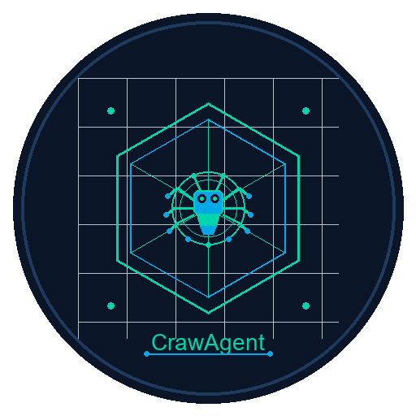
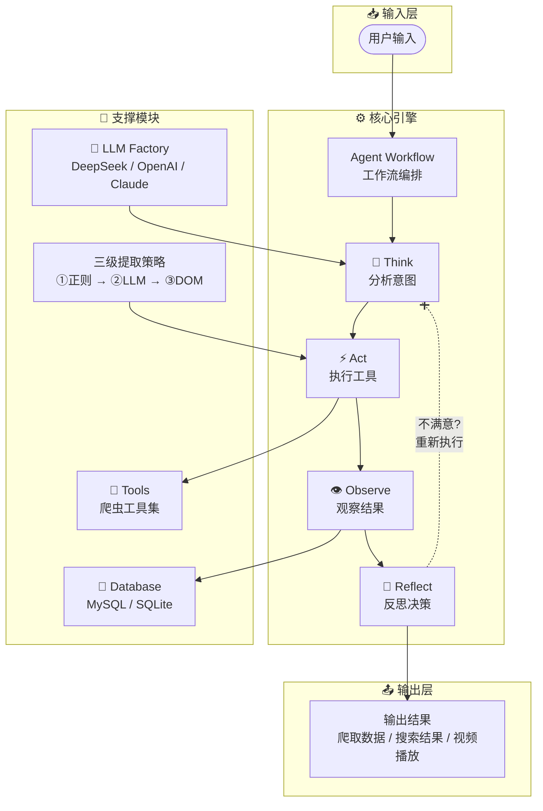

# CrawAgent

<div align="center">



**智能爬虫 Agent 框架**

基于 LangGraph 的智能爬虫系统，支持视频解析、网页爬取、数据提取等功能

[](https://www.python.org/downloads/)
[](https://github.com/langchain-ai/langchain)
[](LICENSE)

[功能特性](#功能特性) • [快速开始](#快速开始) • [使用示例](#使用示例) • [架构设计](#架构设计) • [配置说明](#配置说明)

</div>

---

## 📖 简介

CrawAgent 是一个基于 LangGraph 构建的智能爬虫 Agent 框架，采用 **Think → Act → Observe → Reflect** 的循环架构，能够自主决策、执行和优化爬取策略。支持多种数据源爬取、视频解析播放、智能搜索匹配等功能。

### ✨ 核心亮点

- **智能决策引擎**: 基于 LLM 的自主决策系统，自动选择最佳爬取策略
- **三级提取策略**: 正则表达式 → LLM 增强 → Playwright DOM 深度提取，确保高成功率
- **视频播放器**: 内置 Flask 视频播放器，支持搜索、播放、进度记忆
- **数据库缓存**: MySQL 持久化存储，避免重复爬取和反爬拦截
- **智能匹配算法**: 连续实词匹配算法，提供精准搜索结果

---

## 🚀 功能特性

### 🤖 智能爬虫 Agent

| 功能 | 描述 |
|------|------|
| **自主决策** | LLM 分析用户意图，自动选择合适工具 |
| **多策略提取** | 正则 → LLM → 浏览器渲染三层回退机制 |
| **反爬对抗** | TLS 指纹伪装、浏览器隐身、代理支持 |
| **并发处理** | 多 URL 并行爬取，提升效率 |

### 📺 视频解析与播放

- **视频搜索**: 支持关键词搜索，智能匹配标题
- **在线播放**: Web 播放器，支持 HLS (.m3u8) 流媒体
- **集数管理**: 自动识别电视剧/综艺集数，支持选集播放
- **封面展示**: 自动提取视频封面，优化浏览体验

### 🔍 智能搜索匹配

- **连续实词匹配**: 优先匹配连续字符（2字: 80分，3字: 180分，全词: 1000分）
- **数据库优先**: 先查询本地数据库，减少网络请求
- **增量更新**: 自动检测新视频，保持数据最新

### 💾 数据存储

- **MySQL 存储**: 可选 MySQL 数据库，支持大规模数据
- **SQLite 兼容**: 默认 SQLite，无需额外配置
- **自动去重**: 智能合并重复记录，保留最新数据

---

## 📦 快速开始

### 环境要求

- Python 3.10+
- MySQL 8.0+ (可选)
- Chrome/Edge 浏览器（用于浏览器自动化）

### 安装步骤

```bash
# 1. 克隆项目
git clone https://github.com/your-username/CrawAgent.git
cd CrawAgent

# 2. 创建虚拟环境
python -m venv .venv
.venv\Scripts\activate  # Windows
# source .venv/bin/activate  # Linux/macOS

# 3. 安装依赖
pip install -r requirements.txt

# 4. 安装浏览器驱动
playwright install chromium

# 5. 配置环境变量（可选）
cp .env.example .env
# 编辑 .env 文件，填入 API Key

# 6. 检查依赖
python main.py --check-deps
```

### 配置模型

编辑 `models.json` 文件，配置你的 LLM API：

```json
{
  "provider": "deepseek",
  "model": "deepseek-chat",
  "api_key": "sk-xxxxx",
  "base_url": "https://api.deepseek.com"
}
```

或使用环境变量（在 `.env` 文件中）：

```bash
DEEPSEEK_API_KEY=sk-xxxxx
```

### 启动应用

```bash
# 启动交互式终端
python main.py

# 启动视频播放器
python video_player_app.py
# 访问 http://localhost:5000
```

---

## 💡 使用示例

### 交互式终端

启动后，你可以直接输入自然语言指令：

```
CrawAgent> 爬取 https://weibo.com 热榜
CrawAgent> 搜索《奔跑吧》综艺节目
CrawAgent> 我想看《长安女子鉴》电视剧
CrawAgent> 提取这个页面的所有链接：https://example.com
```

### 视频播放器

访问 `http://localhost:5000`，在搜索框输入视频名称：

- 搜索支持模糊匹配
- 点击视频卡片进入播放页
- 支持选集播放
- 自动记忆播放进度

### Python API

```python
from crawagent.tools.video_parser import FengHuangVideoParser

# 初始化解析器
parser = FengHuangVideoParser()

# 搜索视频
results = parser.search("奔跑吧", page=1, page_size=20)

# 获取播放链接
play_url = parser.get_play_url(video_id="12345", some_id="1", episode=1)

# 获取视频详情
info = parser.get_video_info("12345")
```

---

## 🏗️ 架构设计

### 核心架构



> 💡 **详细架构图**: 同时提供了 [architecture-diagram.excalidraw](architecture-diagram.excalidraw)，可在 [Excalidraw](https://excalidraw.com) 中打开编辑

**架构核心：Think → Act → Observe → Reflect 循环**

| 阶段 | 说明 |
|------|------|
| **🤔 Think** | LLM 分析用户意图，决策选择工具和策略 |
| **⚡ Act** | 执行选定的爬虫工具，进行实际数据获取 |
| **👁️ Observe** | 观察执行结果，提取数据并存储到数据库 |
| **🔄 Reflect** | 反思结果质量，不满意则调整策略重新执行 |

**关键特性：**
- 三级提取策略（正则 → LLM → DOM 深度提取）
- LLM Factory 支持多种模型（DeepSeek、OpenAI、Claude）
- MySQL 数据库持久化存储
- 循环迭代机制，确保数据质量

### 目录结构

```
CrawAgent/
├── crawagent/                 # 核心模块
│   ├── agent/                 # Agent 定义
│   │   ├── tools.py          # 工具注册
│   │   └── skill_loader.py   # 技能加载
│   ├── graph/                 # 工作流图
│   │   ├── agent_workflow.py # Agent 主工作流
│   │   └── workflow.py       # 任务编排
│   ├── tools/                 # 爬虫工具
│   │   ├── base_crawler.py   # 基础爬虫
│   │   ├── browser_crawler.py# 浏览器爬虫
│   │   ├── list_extractor.py # 列表提取器
│   │   ├── video_parser.py   # 视频解析器
│   │   ├── database.py       # 数据库管理
│   │   └── ...               # 其他工具
│   ├── llm/                   # LLM 工厂
│   │   └── factory.py        # 模型创建
│   ├── config/                # 配置管理
│   │   └── settings.py       # 全局配置
│   └── ui/                    # 用户界面
│       └── terminal.py       # 终端 UI
├── video_player_app.py        # 视频播放器应用
├── main.py                    # 主入口
├── requirements.txt           # 依赖列表
└── README.md                  # 本文档
```

### 列表提取策略

CrawAgent 采用三级回退策略提取网页列表：

```
第一级：正则表达式提取
    │
    ├─ 成功 ──▶ 返回结果
    │
    └─ 失败/质量低 ──▶ 第二级：LLM 增强
                          │
                          ├─ 成功 ──▶ 返回结果
                          │
                          └─ 失败 ──▶ 第三级：Playwright DOM 深度提取
                                          │
                                          └─ 返回最终结果
```

---

## ⚙️ 配置说明

### 环境变量 (.env)

```bash
# LLM API Keys
DEEPSEEK_API_KEY=sk-xxxxx
MIMO_API_KEY=tp-xxxxx

# 数据库配置
CRAWAGENT_DB_TYPE=mysql          # 或 sqlite
CRAWAGENT_MYSQL_HOST=localhost
CRAWAGENT_MYSQL_PORT=3306
CRAWAGENT_MYSQL_USER=root
CRAWAGENT_MYSQL_PASSWORD=your_password
CRAWAGENT_MYSQL_DATABASE=crawagent
```

### 数据库表结构

**crawl_records 表**：

| 字段 | 类型 | 说明 |
|------|------|------|
| id | INTEGER | 主键 |
| url | TEXT | 页面 URL |
| title | TEXT | 标题 |
| content | TEXT | 内容 |
| source | TEXT | 来源 |
| extra_data | JSON | 额外数据 |
| created_at | DATETIME | 创建时间 |

---

## 🛠️ 开发指南

### 添加新工具

1. 在 `crawagent/tools/` 创建工具文件
2. 在 `crawagent/agent/tools.py` 注册工具
3. 更新 `TOOL_SYSTEM_PROMPT` 添加工具说明

### 自定义 LLM

1. 在 `crawagent/llm/factory.py` 添加新 Provider
2. 更新 `models.json` 配置

### 扩展视频解析

1. 分析目标网站 API
2. 继承 `FengHuangVideoParser` 类
3. 实现自定义解析逻辑

---

## 📊 项目统计

- **核心代码**: ~5000+ 行
- **支持工具**: 10+ 种
- **爬取策略**: 3 级回退
- **搜索算法**: 连续实词匹配

---

## 🤝 贡献指南

欢迎提交 Issue 和 Pull Request！

1. Fork 本仓库
2. 创建特性分支 (`git checkout -b feature/AmazingFeature`)
3. 提交更改 (`git commit -m 'Add some AmazingFeature'`)
4. 推送到分支 (`git push origin feature/AmazingFeature`)
5. 开启 Pull Request

---

## 📄 许可证

本项目采用 MIT 许可证 - 详见 [LICENSE](LICENSE) 文件

---

## 🙏 致谢

- [LangChain](https://github.com/langchain-ai/langchain) - LLM 应用框架
- [LangGraph](https://github.com/langchain-ai/langgraph) - 工作流编排
- [Playwright](https://playwright.dev/) - 浏览器自动化
- [Scrapling](https://github.com/D4Vinci/Scrapling) - 高级爬虫库

---

<div align="center">

**如果这个项目对你有帮助，请给一个 ⭐️ Star！**

Made with ❤️ by CrawAgent Team

</div>