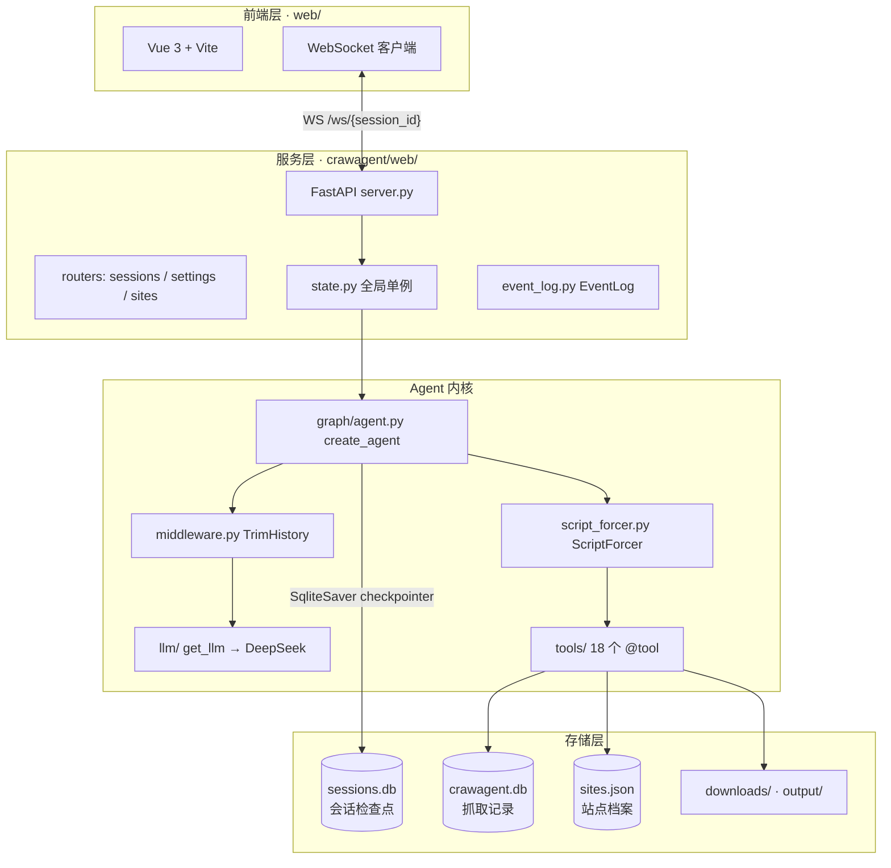
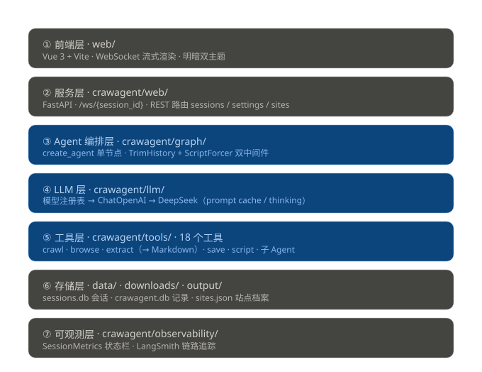
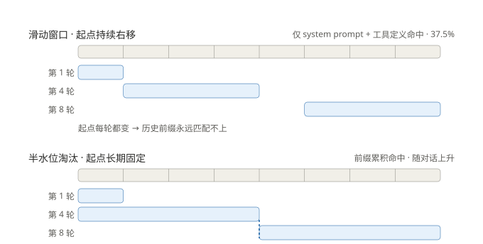
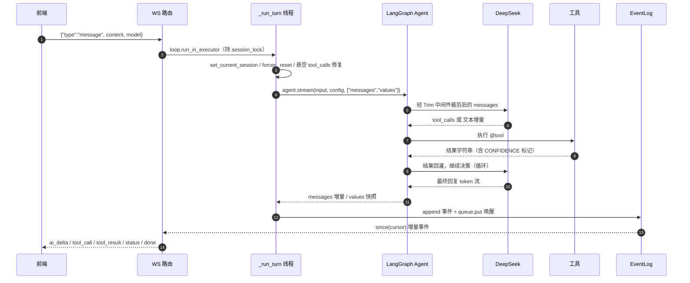
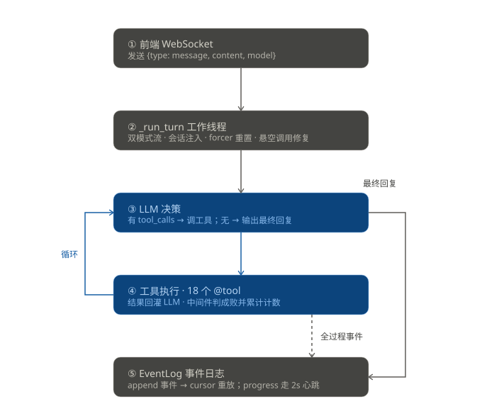
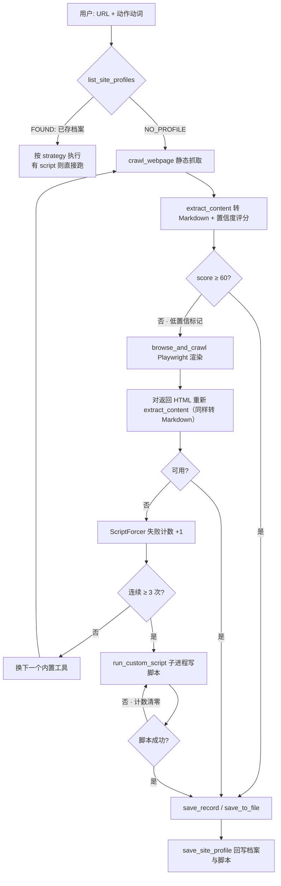
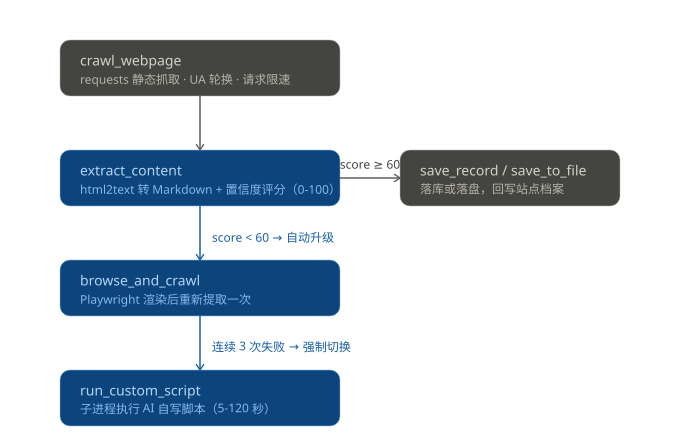

# 08 · 系统架构设计

> 面向维护者的架构说明：分层职责、核心模块、数据流与关键设计决策。
> 代码级细节见 `docs/03-核心机制.md`，本文件聚焦「结构」与「为什么这么设计」。
> 配套架构图：`docs/architecture/01-分层架构.svg`、`02-单轮数据流.svg`、`03-降级链路.svg`。

---

## 1. 系统定位

CrawAgent 是一个 **LLM 驱动的智能爬虫 Agent**：用户用自然语言下达抓取任务，Agent 自主选择工具、判断抓取质量、在失败时降级换策略，最终把结果落库或落盘。

它不是工作流引擎，也不是多 Agent 编排框架——**只有一个主 Agent 节点**，LLM↔工具的循环完全交给 LangChain `create_agent` 内部处理，项目自身不实现 tool loop。工程量集中在四件事上：

1. **治理 LLM**：让 prompt cache 每次命中、历史不撑爆上下文
2. **治理工具**：防止 Agent 在失败工具之间无限打转
3. **治理传输**：让 WebSocket 断线重连后事件不丢
4. **治理可见性**：让长时间阻塞的子任务持续上报进度，而不是让前端黑屏

其中第 1 条是贯穿全局的主线：缓存命中率直接决定成本，因此「历史怎么裁剪」「强制消息往哪插」这些看似局部的实现细节，都必须按「是否打碎前缀」来决策。

---

## 2. 架构总览





### 分层职责

| 层 | 目录 | 职责 | 不该做什么 |
|----|------|------|-----------|
| 前端层 | `web/` | 渲染对话流、工具轨迹、状态栏；维护明暗主题 | 不含业务逻辑，不直接访问数据库 |
| 服务层 | `crawagent/web/` | WS 会话管理、线程桥接、事件日志、REST 路由 | 不实现 Agent 逻辑，不调用工具 |
| 编排层 | `crawagent/graph/` | 装配 Agent、中间件治理、子 Agent 委派 | 不写具体抓取逻辑 |
| LLM 层 | `crawagent/llm/` | 多服务商模型解析、思考模式、超时重试 | 不含 prompt 业务内容 |
| 工具层 | `crawagent/tools/` | 18 个原子能力，每个 `@tool` 自带完整 docstring | 工具之间不互相调用 |
| 存储层 | `data/` `downloads/` `output/` | SQLite 持久化 + 文件产物 | 无 |
| 可观测层 | `crawagent/observability/` | 指标采集与状态栏格式化 | 不依赖 FastAPI，终端/Web 共用 |

---

## 3. 核心模块详解

### 3.1 服务层：`crawagent/web/`

| 模块 | 行数 | 职责 |
|------|------|------|
| `server.py` | 460 | FastAPI 应用、`/ws/{session_id}`、`_run_turn` 工作线程、`_stream_turn` 订阅协程 |
| `state.py` | 67 | 全局单例：Agent 缓存、checkpointer、会话锁、活跃轮次表 |
| `event_log.py` | 31 | `EventLog`——append-only 事件列表 + cursor 增量读取 |
| `routers/sessions.py` | 272 | 会话列表 / 历史回放 / 删除（含归档）/ 批量删除 |
| `routers/settings.py` | 255 | 多服务商模型注册表 CRUD、思考深度、连通性测试 |
| `routers/sites.py` | 58 | 站点档案 CRUD，与工具层共享 `data/sites.json` |

**三个关键设计：**

1. **Agent 按模型缓存**：`_agents[model_id]`，同一模型跨会话复用；改配置后 `reset_agent_cache()` 整体失效重建。checkpointer 与 Agent 分离创建——缺 API Key 时会话列表仍可读。

2. **悬空 tool_calls 自愈**：任务在工具执行中被重启，会留下「AIMessage 带 tool_calls 但无配对 ToolMessage」的非法历史，此后每一轮 LLM 调用都返回 400。`_run_turn` 开局扫描并用 `RemoveMessage` 摘除，会话自动恢复。

3. **事件日志是真相源，队列只做唤醒**：worker 线程把事件 `append` 进 `EventLog`，再用 `call_soon_threadsafe` 通知队列；订阅协程按 `cursor` 从日志取。页面刷新后新订阅者从 `cursor=0` 全量重放，`done`/`error` 永不丢失。

### 3.2 编排层：`crawagent/graph/`

```
create_agent(
    model        = get_llm(),          # DeepSeek / 注册表内任意模型
    tools        = [18 个 @tool],
    system_prompt= SYSTEM_PROMPT,      # 纯静态，缓存命中的前提
    checkpointer = SqliteSaver,        # 按 thread_id = session_id 持久化
    middleware   = [Trim, ScriptForcer],
)
```

**`agent.py`（257 行，其中 SYSTEM_PROMPT 占 154 行）**
System prompt 是纯静态字符串，内含 8 条硬规则：TOOL USE JUDGMENT 决策树、AUTH WALL RULE、BATCH-FIRST RULE、DOWNLOAD PATH RULE、TOOL BUDGET RULE、CROSS-SESSION ISOLATION、置信度升级规则、站点档案工作流。它是整个系统的「行为契约」，也是最大的单点。

**`middleware.py` · TrimHistoryMiddleware —— 治 token 膨胀**

矛盾：checkpointer 需要完整历史（保证缓存前缀稳定），但传给 LLM 的消息不能无限增长。解法是在 `wrap_model_call` 里**只改 LLM 输入、不改持久化 state**：

| 策略 | 参数 | 行为 |
|------|------|------|
| 工具结果裁剪 | `tool_result_max_chars = 2000` | 超长 ToolMessage 保留首 1000 + 尾 500 字符；确定性截断，同一条消息每次结果相同 |
| 半水位淘汰 | `history_max_tokens = 32000` | 超限时**一次性**淘汰到半水位（max/2），此后窗口固定、只追加 |
| 轮数下限 | `history_keep_recent_turns = 3` | 淘汰起点不得晚于倒数第 3 轮；3 轮本身超水位时宁超预算也不再砍 |

**为什么把「滑动窗口」换成「半水位淘汰」**（本次优化的核心）：

旧策略「固定保留最近 N 轮」每轮都在移动窗口起点，导致**历史前缀永远无法命中缓存**——实测命中率只有 37.5%，命中的仅仅是 system prompt + 工具定义那一小段。新策略超限时一次性淘汰到半水位，此后起点固定不动，消息只追加，前缀随对话变长、命中率持续上升；要再涨 max/2 才会触发下一次淘汰（摊销，避免频繁重算）。



「轮数下限」是安全垫：淘汰起点不得晚于倒数第 3 轮，若 3 轮本身就超过半水位，**宁超预算也不缺上下文**（不再像旧策略那样激进砍到只剩最后一轮）。

硬约束：ToolMessage 必须与其配对的 `AIMessage.tool_calls` 同留同删，否则 OpenAI 报 `tool_call_id` 不匹配。

**`script_forcer.py` · ScriptForcerMiddleware —— 治死循环**

历史上出现过连调 72 次工具不换策略的死循环。中间件在 `wrap_tool_call` 里用 16 条失败正则 + 5 条成功正则判定每次结果，在 `wrap_model_call` 里注入 SystemMessage 强制改道：

| 触发条件 | 注入内容 |
|----------|----------|
| 连续失败 ≥ 3 | 必须用 `run_custom_script` |
| 连续失败 ≥ 5 | 最强指令，禁止调用任何内置工具 |
| 单轮总调用 ≥ 30 | TASK FORCE-FINISH，立即输出最终答案 |
| 连续同工具 ≥ 5 | 判定为死循环，必须换策略 |

**注入位置：追加到 messages 末尾，不插头部**。DeepSeek 缓存基于前缀匹配，在头部插入 SystemMessage 会打碎整个前缀、命中率归零；追加到末尾只增加 miss tokens（新消息），已缓存的前缀不受影响。

细节：`run_custom_script` 自身失败**不计入**计数（允许脚本换思路重试），但会清零强制标志；每轮对话开始时 `server.py` 调 `_reset()`，防止跨轮累积误触发。

**`subagents/video_finder.py` · Agent-as-Tool**

视频站点发现子 Agent，工具集 5 个（`web_search` / `probe_video_player` / `analyze_site_structure` / `browse_and_crawl` / `run_custom_script`），**不传 checkpointer、无中间件、一次性执行**，输出精简 JSON 供主 Agent 后处理。这是项目里唯一的 Agent 嵌套，也是唯一的「工具内部再跑 LLM」路径。

**进度上报机制**（本次新增）：子 Agent 一次调用要跑「搜索 → 逐站探测 → 评分排序」，可能同步阻塞上百秒，期间前端只显示"deeply exploring..."——用户完全不知道在干什么。解法是让子 Agent 边跑边把里程碑写进全局进度队列，服务端心跳取出来推前端：

```
run_video_finder(query)
  └─ get_graph().stream(stream_mode="values")   # 边跑边对比 messages 差异
       └─ _summarize_tool(tool_name, args, result)  → add_milestone(run_id, 一句话摘要)
            └─ PROGRESS_INDEX[run_id] / PROGRESS_TICK（threading.Lock 保护）
                 └─ consume_new()  ← server.py 每 ~2s 心跳调用
                      └─ WS {"type": "progress", run_id, lines, done, error, elapsed}
```

- 用 `get_graph().stream()` 而非「先 stream 再 invoke」——避免为了采集进度把任务跑两遍
- `get_graph()` 不可用时回退到 invoke 后一次性扫描 messages
- 内存清理：run 完成后 30 秒从 `PROGRESS_INDEX` 移除，避免泄漏
- 子 Agent 返回的 JSON 里额外带 `milestones` 数组，供主 Agent 在最终回复中给出进度摘要

### 3.3 LLM 层：`crawagent/llm/`

```
.env LLM_PROVIDERS (JSON) → registry.resolve_model(model)
                          → (model_name, base_url, api_key)
                          → ChatOpenAI(**kwargs) → DeepSeek API
```

| 文件 | 职责 |
|------|------|
| `registry.py` | 解析多服务商注册表；未命中则回退全局 `OPENAI_*` 配置 |
| `model.py` | 构造 `ChatOpenAI`，映射思考模式 |

**Prompt Caching 的四条纪律**（改任何一条都会让缓存命中率归零）：
1. SYSTEM_PROMPT 纯静态，无时间戳/随机数
2. 工具 docstring 稳定，不运行时修改
3. 消息顺序固定：system → tools → history
4. 历史 append-only，从不修改已写入的消息

**思考模式映射**：

| `thinking_depth` | 行为 |
|------------------|------|
| `off` | `thinking: disabled` + `temperature=0` |
| `low` / `high` / `max` | `thinking: enabled` + `reasoning_effort`，不传采样参数 |
| `medium` | 映射为 `high`（DeepSeek 仅 3 档） |

推理内容从 `AIMessage.additional_kwargs.reasoning_content` 提取；无该字段时退而求其次取「带 tool_calls 时的 content」或 `<think>` 标签包裹段，统一以 `ai_thinking` 事件推前端折叠展示。

### 3.4 工具层：`crawagent/tools/`（18 个工具）

| 分组 | 工具 | 底层 |
|------|------|------|
| **通用抓取** | `crawl_webpage`、`browse_and_crawl` | requests + UA 轮换 / Playwright |
| **内容提取** | `extract_content`、`extract_list`、`extract_wallpaper_list`、`wallpaper_detail` | html2text（DOM 树整体转 Markdown）+ BeautifulSoup4 + lxml |
| **社交媒体** | `extract_social_media`、`download_social_media` | 抖音/B站解析 + ffmpeg 合并 |
| **微信读书** | `list_weread_chapters`、`get_weread_chapter` | 站点档案中的 Cookie |
| **站点档案** | `list_site_profiles`、`save_site_profile` | `data/sites.json` |
| **持久化** | `save_record`、`list_crawled_resources`、`save_to_file` | SQLite / 文件系统 |
| **媒体下载** | `download_images` | requests + Referer 防盗链 |
| **兜底** | `run_custom_script` | 子进程执行 AI 自写的 Python |
| **委派** | `video_site_expert` | 子 Agent |

未在主流 Agent 注册、仅供子 Agent 使用的工具：`web_search`、`probe_video_player`、`analyze_site_structure`。
库而非工具：`font_decrypt.py`（番茄小说 PUA 字体解密）、`confidence.py`（置信度评分）。

**工具即插件**：`@tool` 装饰器 + docstring 即工具规范（docstring 会被序列化进 API 请求，直接决定 LLM 的调用决策），新增工具只需在 `agent.py` 的 tools 列表里加一行。

#### 本次变更：提取结果从「平铺文本」改为「Markdown」

`extract_content` 与 `browse_and_crawl` 的输出格式是本次最大的行为变更。旧实现用 `find_all` 平铺抓段落，拼成 `Title / Body / Links` 三段式纯文本；新实现用 html2text 按 DOM 树整体转换：

| 环节 | 实现 |
|------|------|
| 主内容定位 | 优先 `<article>` → `<main>` → `<body>`，容器文本 < 200 字符时回退全文（避开侧栏噪音） |
| 格式保留 | 标题层级 `#/##/###`、\`\`\` 围栏代码块（保留原始缩进）、列表标记、引用、表格、行内链接与行内代码 |
| 代码语言标注 | `_extract_code_langs` 从 `<pre><code class="language-x">` 提取语言，回填到 html2text 输出的裸围栏上 |
| 去重 | `_dedupe_blocks` 按空行分块 + 空白归一化比较，被 `<span>`/空白包裹的重复段落不再逃逸 |
| 标题调和 | `_reconcile_title`：正文首个 h1 与 `<title>` 高度相似（`<title>` 常带 `-CSDN博客` 类后缀）时用 h1 覆盖，保证全文只有一个一级标题 |

`browse_and_crawl` 渲染完成后走同一套转换（内部 `_html_to_md`），但**字体加密场景（PUA）保持纯文本**——`decrypt_text` 面向纯文本工作，转 Markdown 会破坏解密。

两点影响需要注意：
1. **不再输出 Links 列表**。需要链接时用 `extract_list`，或在 `run_custom_script` 里自己解析。
2. 输出体积普遍变大（保留了格式标记），这也是 `tool_result_max_chars` 从 500 提到 2000 的直接原因。

#### 本次变更：子进程输出编码修复

`run_custom_script` 在 Windows 上默认按 GBK 解码子进程输出，脚本 `print()` 中文会直接崩掉读取线程。现改为 `encoding="utf-8", errors="replace"`，并给子进程注入 `PYTHONIOENCODING=utf-8`。

### 3.5 存储层

| 载体 | 内容 | 访问方 |
|------|------|--------|
| `data/sessions.db` | SqliteSaver 检查点（`checkpoints` / `writes` 表），按 `thread_id` = `session_id` | `state.get_checkpointer()` |
| `data/crawagent.db` | `crawl_records` 表：抓取记录 | `save_tool` / `query_tool` |
| `data/sites.json` | 站点档案数组：origin / title / strategy / notes / cookies / script | `site_profile_tool` + `/api/sites` |
| `downloads/` | 图片、视频、音频等媒体产物（硬规则） | 下载类工具 |
| `output/` | 文本 / markdown 文档（硬规则） | `save_to_file` |
| `logs/` | 会话删除前的归档 JSON + 运行日志 | `routers/sessions.py` |

`crawl_records` 表结构：

| 字段 | 类型 | 说明 |
|------|------|------|
| `id` | INTEGER PK | 自增 |
| `url` / `title` / `content` | TEXT | 抓取正文 |
| `extra_data` | TEXT | 附加数据（JSON 字符串），如链接列表 |
| `platform` | TEXT | 未指定时由 URL 域名映射推断（14 个已知平台） |
| `save_path` | TEXT | 若同时落盘，记录文件路径 |
| `session_id` | TEXT | 会话隔离键，由 `ContextVar` 自动注入 |
| `created_at` | TEXT | ISO 时间 |

会话隔离：`save_record` 通过 `ContextVar` 读取当前 `session_id`（`_run_turn` 在线程开头设置），`list_crawled_resources` 默认 `scope="session"` 只查本会话，避免「继续上次任务」时串到别的会话。

### 3.6 可观测层

`SessionMetrics` 是 UI 无关的纯数据层，终端和 Web 共用。采集 6 类指标：LLM 调用次数与耗时、首 token 延迟、工具调用次数与总耗时、输入输出 token、缓存命中/未命中 token、tok/s。

缓存统计的取数有版本兼容处理：优先读 `response_metadata.token_usage.prompt_cache_hit_tokens`（权威），`usage_metadata.input_token_details.cache_read` 作为兜底。最终由 `status_line()` 格式化为一行状态栏，每个工具完成后推送一次，长任务下前端状态栏实时跳动。

---

## 4. 数据流

### 4.1 单轮对话（完整链路）





### 4.2 WebSocket 事件协议

| 事件 | 载荷 | 触发时机 |
|------|------|----------|
| `resumed` | — | 重连时任务仍在运行，前端立刻恢复 busy 态 |
| `progress` | `run_id`, `query`, `lines`, `done`, `error`, `elapsed`, `total_milestones` | 子 Agent 里程碑，服务端每 ~2s 心跳推送（本次新增） |
| `tool_call` | `tool_call_id`, `name`, `args` | LLM 请求调用工具 |
| `tool_result` | `tool_call_id`, `content` | 工具返回（前端截断预览 600 字符） |
| `ai_thinking` | `id`, `content` | 推理内容，前端折叠展示 |
| `ai_delta` | `id`, `delta` | 最终回答的 token 增量 |
| `ai_done` | `id` | 该条流式回复结束 |
| `ai` | `content` | 非流式兜底整段回复 |
| `status` | `line` | 状态栏，工具完成时与轮次结束时各推一次 |
| `done` | — | 本轮正常结束 |
| `error` | `message` | 本轮失败 |

去重靠三张表：`shown_ids`（避免把检查点里的历史消息重放给前端）、`streamed_ai`（已流式推送过的消息不再整段重发）、`ended_llm_ids`（token 用量不重复结算）。

### 4.3 抓取降级流（自愈链路）





**置信度评分**（基准 100，纯规则启发式，毫秒级、零 LLM 成本）：

| 检查项 | 分值 |
|--------|------|
| 内容为空 | −50 |
| 内容 < 200 字 | −30 |
| PUA 乱码 > 10%（字体加密） | −60 |
| PUA 乱码 > 5% | −40 |
| 反爬标记（403 / 登录 / 验证码） | −50 |
| JS 占位（loading / 请启用 JavaScript） | −40 |
| 句子数 < 3 | −20 |
| 内容 > 500 字 | +10 |
| 中文占比 > 30% | +10 |
| 句子数 > 10 | +10 |

这条规则的意义在于：**把「抓取质量判断」从 LLM 手里拿走**。LLM 判断又慢又贵又不稳定，规则打分瞬间完成，只在结果尾部追加一个 `[LOW CONFIDENCE: score=N]` 标记，由 system prompt 里的硬规则驱动下一步动作。

### 4.4 会话持久化与恢复

- `SqliteSaver` 按 `thread_id` = `session_id` 存**完整**消息历史，append-only
- 进程重启后 WebUI 重连自动恢复上下文，无需向量库
- 删除会话：先归档完整消息到 `logs/{session_id}_{时间戳}.json`，再清 `checkpoints` / `writes` 两表
- 服务重启后内存指标丢失时，`_reconstruct_status()` 从检查点消息重建状态栏（耗时类数据无法恢复，只还原轮数/步数/token）

### 4.5 配置数据流

```
设置页前端 → POST /api/models → routers/settings.py
                              → 改写 .env 的 LLM_PROVIDERS（保留注释与其他键）
                              → reset_agent_cache()
                              → 下次对话 get_agent(model) 按新配置重建
```

API Key 永不出后端：GET 只返回 `key_set: bool`。

---

## 5. 并发与线程模型

```
asyncio 事件循环（FastAPI）
  ├── chat_ws          协程：收消息、管理 stream_task
  ├── _stream_turn     协程：按 cursor 读 EventLog，ws.send_text
  │     └── 心跳：每 ~2s 调 consume_new() 取子 Agent 进度 → progress 事件
  └── session_lock     每会话一把 asyncio.Lock，轮次创建/重连互斥

默认线程池（run_in_executor）
  └── _run_turn        线程：跑 agent.stream 同步生成器
        ├── set_current_session(session_id)   # ContextVar，线程内安全
        ├── 子 Agent（video_site_expert）在此线程内同步阻塞
        │     └── add_milestone() → PROGRESS_INDEX（threading.Lock 保护）
        └── _emit → EventLog.append + loop.call_soon_threadsafe
```

要点：

- **同步流必须放线程**：`agent.stream` 是同步生成器，直接 await 会阻塞整个事件循环
- **ContextVar 传会话**：工具执行与 `agent.stream` 同线程，省去向 LLM 传 `session_id` 参数
- **跨线程通信有两套**：worker → 订阅协程走 `call_soon_threadsafe` + EventLog；子 Agent → 心跳协程走 `threading.Lock` + `PROGRESS_INDEX`。前者是事件流，后者是状态快照，职责不同不要混用
- **停止是协作式的**：`cancelled` 标志只在**当前工具调用完成后**生效，无法中断正在跑的 `run_custom_script`
- **`ws_id` 仲裁订阅者**：新 WS 订阅时更新 `ws_id`，旧订阅协程检测到不匹配后自动退出

---

## 6. 关键设计决策

| # | 决策 | 理由 | 代价 |
|---|------|------|------|
| 1 | System prompt 纯静态 | DeepSeek prompt cache 每次命中，成本降一个量级 | system prompt 内不能放任何动态上下文（如当前时间） |
| 2 | 不自建 tool loop | 复用 `create_agent`，省掉一整套循环/错误恢复代码 | 循环行为受框架约束，定制需走中间件 |
| 3 | 裁剪只改 LLM 输入不改 state | 兼顾「缓存前缀稳定」与「上下文不膨胀」 | 持久化状态仍会无限增长（见风险 1） |
| 3a | **淘汰用半水位而非滑动窗口** | 滑动窗口每轮移动起点 → 历史前缀永远不命中（实测 37.5%）；半水位淘汰后起点固定、只追加，命中率随对话上升 | 超预算时会一次性丢掉较多历史（故需保留 3 轮下限兜底） |
| 3b | **强制消息追加到末尾而非插头部** | 头部插入会打碎 DeepSeek 前缀缓存、命中率归零；追加只增加 miss tokens | 强制指令出现在对话末尾，模型注意力上弱于头部（实践中影响可接受） |
| 4 | 用规则判置信度而非 LLM | 毫秒级、零成本、可复现 | 规则覆盖不到的异常页面需靠失败计数兜底 |
| 5 | 事件日志 + cursor 重放 | 彻底解决断线丢 `done` 的问题 | 长任务的事件全在内存，轮次结束才释放 |
| 6 | 失败 3 次强制写脚本 | 治「换工具 → 失败 → 再换」的死循环 | 误判会打断本来能成功的路径（故每轮 `_reset()`） |
| 7 | 站点档案存策略 + 脚本 + Cookie | 同站点二次抓取跳过试错 | Cookie 明文存 JSON（见风险 3） |
| 8 | 子 Agent 无 checkpointer | 一次性任务，无需跨轮记忆 | 子 Agent 内部步骤对前端不可见 |
| 8a | **子 Agent 进度走独立队列 + 心跳** | 子 Agent 同步阻塞上百秒，不上报进度前端就是黑屏；用 `get_graph().stream()` 边跑边采集，避免为采集进度跑第二遍 | 进度是全局 deque 不是按会话隔离，多会话并发时可能串扰（当前单用户场景可接受） |
| 9 | SQLite 而非 MySQL | 零运维，标准库自带 | 单进程写、无并发能力 |
| 10 | **提取结果统一转 Markdown** | 保留标题层级/代码块/列表/表格/链接，`save_to_file` 直接产出可读文档 | 输出体积变大（故 `tool_result_max_chars` 提到 2000）；不再附带 Links 列表 |

---

## 7. 已知约束与风险

| 级别 | 问题 | 影响 | 建议 |
|------|------|------|------|
| 高 | `data/sessions.db` 已 1.1 GB，检查点 append-only 且无清理策略 | 磁盘持续增长，会话列表查询变慢 | 加会话保留策略（按时间/条数归档）+ 定期 `VACUUM` |
| 高 | `run_custom_script` 子进程执行任意代码，无导入沙箱 | 恶意或被诱导的脚本可读写整个项目目录 | 加导入白名单校验、工作目录 chroot、禁网选项 |
| 中 | `_active_turns` / `_metrics` 全在进程内存 | 无法多 worker 部署，重启后运行中任务状态丢失 | 迁到 Redis 或共享存储 |
| 中 | 站点 Cookie 明文存 `data/sites.json` | 本机其他进程可读；`data/` 已被 `.gitignore` 排除，但未加密 | 加密存储，或改用系统钥匙串 |
| 中 | SYSTEM_PROMPT 154 行，8 条硬规则集中在一个字符串 | 改一条可能影响其他行为，无回归测试覆盖 prompt | 拆成模块化片段 + 加 prompt 行为回归用例 |
| 中 | `history_max_tokens` 提到 32000 后，单轮 LLM 输入上限显著抬高 | 长会话下单次请求成本与延迟上升，命中 API 上下文上限的风险变大 | 观察实际 tok/s 与缓存命中率，必要时回落到 16K |
| 低 | 停止按钮只在本工具调用完成后生效 | 长脚本任务无法即时中断 | 子进程层面 kill |
| 低 | 子 Agent 进度队列 `PROGRESS_INDEX` 是全局的，未按 session 隔离 | 多会话并发跑 `video_site_expert` 时进度可能串到别的会话 | 给 `ProgressReport` 加 session 维度过滤 |
| 低 | `uvicorn` 单进程、绑定 `127.0.0.1:8000` | 仅本机可用，无并发能力 | 按需加 `--workers`（需先解决内存态风险） |

### 本轮已修复

| 问题 | 状态 |
|------|------|
| `html2text` 已被 `extract_tool` / `browse_tool` 使用，但未在 `pyproject.toml` 声明 | 已补 `html2text>=2024.2.26`，并重新生成 `uv.lock` |
| 裁剪策略改为半水位淘汰后，`test_window_aggressive_keeps_last_turn_only` 断言的是旧行为，用例失败 | 已改为验证新语义（`test_eviction_half_watermark` + `test_eviction_respects_min_turns_floor`），25 项全部通过 |
| Windows 下子进程输出按 GBK 解码，脚本 `print()` 中文崩溃 | `run_custom_script` 已改为 UTF-8 + `PYTHONIOENCODING` 注入 |

---

## 8. 扩展点

| 想加什么 | 改哪里 |
|----------|--------|
| 新工具 | `tools/` 新建 `@tool` → 在 `graph/agent.py` 的 tools 列表注册 → 在 SYSTEM_PROMPT 补一行说明 |
| 新中间件 | 继承 `AgentMiddleware`，实现 `wrap_model_call` / `wrap_tool_call`，加入 `middleware=[...]` |
| 新子 Agent | 参考 `graph/subagents/video_finder.py`，用 `create_agent` 包装成 `@tool` 后注册 |
| 新服务商模型 | 设置页添加，或直接在 `.env` 的 `LLM_PROVIDERS` JSON 里加一项 |
| 换存储后端 | 实现 `BaseCheckpointSaver` 传入 `get_agent()`；抓取记录需改 `save_tool` / `query_tool` |

---

## 9. 变更记录

本文件随代码演进更新。以下为相对首版（2026-08-30 初稿）的差异。

### 2026-08-30 更新（缓存命中率优化 + Markdown 输出）

| 模块 | 变更 | 影响面 |
|------|------|--------|
| `graph/middleware.py` | 裁剪策略 **滑动窗口 → 半水位淘汰**；`max_tokens` 8000→32000、`tool_result_max_chars` 500→2000；`keep_recent_turns` 语义改为「下限」 | 缓存命中率、单轮成本、长会话上下文完整性 |
| `graph/script_forcer.py` | 强制消息 **插入头部 → 追加末尾** | 触发强制改道时不再打碎缓存前缀 |
| `tools/extract_tool.py` | 重写：BS4 平铺段落 → **html2text 整体转 Markdown**；新增主内容容器定位、代码语言标注、空白归一化去重、标题调和 | 所有抓取产物的格式；**不再输出 Links 列表** |
| `tools/browse_tool.py` | 新增 `_html_to_md`，渲染后同样转 Markdown（PUA 字体加密场景保持纯文本） | 浏览器抓取产物格式 |
| `tools/script_tool.py` | 子进程输出 `encoding="utf-8"` + `PYTHONIOENCODING` 注入 | Windows 下中文脚本不再崩 |
| `graph/agent.py` | SYSTEM_PROMPT 第 3 条同步为 Markdown 描述；删除视频推荐末尾的版权提示句 | 工具选择决策 |
| `graph/subagents/video_finder.py` | 新增进度上报：`ProgressReport` / `PROGRESS_INDEX` / `consume_new()`；改用 `get_graph().stream()` 边跑边采集；输出 JSON 新增 `milestones` | 子 Agent 黑屏问题 |
| `web/server.py` | `_stream_turn` 新增 ~2s 心跳，消费进度队列推 `progress` 事件；异常完成时补推 `status` | 前端新增一种事件类型 |
| `web/src/composables/useChat.js` | 处理 `progress` 事件，把里程碑挂到对应工具步骤 | CrawlTrace 内联展示进度日志 |
| `web/src/components/CrawlTrace.vue` | 新增 `progress_lines` 展示 | 子任务进度可见 |
| `pyproject.toml` / `uv.lock` | 新增 `html2text>=2024.2.26` 依赖声明 | 新环境不再缺依赖 |
| `tests/test_pure_tools.py` | 失效用例改为验证新淘汰语义，并补 1 个用例 | 25 项全部通过 |
